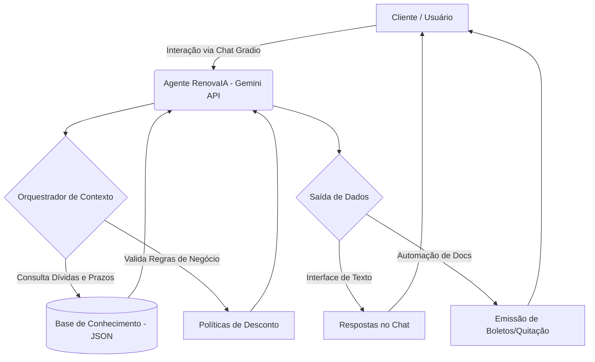

# Documentação do Agente: RenovaIA

## 1. Caso de Uso

### Problema
Clientes em situação de inadimplência enfrentam processos de renegociação estressantes. As principais reclamações de clientes bancários envolvem a dificuldade de falar com atendentes, falta de clareza nas taxas e a demora para emitir boletos de acordos ou cartas de quitação.

### Solução
O **RenovaIA** é um agente financeiro inteligente que utiliza IA Generativa para atuar como mediador de dívidas. Ele humaniza o atendimento, oferece transparência total sobre juros e automatiza tarefas práticas como emissão de segunda via de boletos e simulações de parcelamento em tempo real.

### Público-Alvo
Clientes Pessoa Física em situação de inadimplência que buscam agilidade, clareza e autonomia para regularizar sua saúde financeira.

---

## 2. Persona e Tom de Voz

### Nome do Agente
**RenovaIA**

### Personalidade
Consultivo, empático, resolutivo e imparcial. O agente não julga o cliente pela dívida, mas foca proativamente na solução e na educação financeira básica.

### Tom de Comunicação
Acolhedor, transparente e direto. O agente traduz termos técnicos ("juridiquês") para uma linguagem simples e acessível.

### Exemplos de Linguagem
- **Saudação:** "Olá! Eu sou o RenovaIA. Meu objetivo é ajudar você a recuperar seu fôlego financeiro. Vamos analisar suas opções de acordo hoje?"
- **Confirmação:** "Compreendo perfeitamente. Estou verificando no sistema a melhor oferta de desconto para o seu perfil. Só um instante."
- **Erro/Limitação:** "Sinto muito, mas essa condição de parcelamento foge das minhas alçadas atuais. Posso gerar o boleto da proposta anterior ou te conectar agora com um especialista humano?"

---

## 3. Arquitetura

### Diagrama de Fluxo (Mermaid)

### Componentes Técnicos

| Componente | Descrição |
| :--- | :--- |
| **Interface** | Chatbot interativo desenvolvido em Gradio, otimizado para simular a experiência de atendimento bancário via mobile. |
| **LLM** | Google Gemini 1.5 Flash, escolhido pela alta velocidade de processamento e precisão em tarefas de negociação. |
| **Orquestração** | Lógica em Python utilizando System Instructions para gerenciar o fluxo de diálogo e a recuperação de dados. |
| **Base de Conhecimento** | Arquivo JSON (mockado) com dados de clientes, contratos, dívidas e prazos para consulta (RAG simplificado). |
| **Validação** | Camada de regras de negócio e instruções de sistema para evitar alucinações e proteger dados sensíveis. |

## 4. Segurança e Anti-Alucinação

### Estratégias Adotadas

**1. Grounding Baseado em Dados**  
O agente responde exclusivamente com base nas dívidas existentes na base de conhecimento (arquivo JSON).  
Caso o CPF não seja encontrado, nenhuma informação fictícia é gerada.

**2. Protocolo de Quitação**  
Para emissão de boletos e cartas de quitação, o agente segue um fluxo estruturado de confirmação de dados, reduzindo risco de erros no envio.

**3. Transparência Bancária**  
Toda simulação de acordo apresenta explicitamente:
- Valor Original  
- Desconto Aplicado  
- Juros  
- CET (Custo Efetivo Total)

**4. Fallback Humano**  
Sempre que o cliente demonstrar frustração, solicitar algo fora do escopo ou demandar atendimento especializado, o agente informa os canais oficiais de SAC e Ouvidoria.

---

### Limitações Declaradas

- O agente não altera dados cadastrais sensíveis (endereço, telefone, etc.).
- Não realiza pagamentos diretamente — apenas gera meios de pagamento (ex: linha digitável).
- Não concede descontos acima do limite parametrizado na base de dados JSON.
