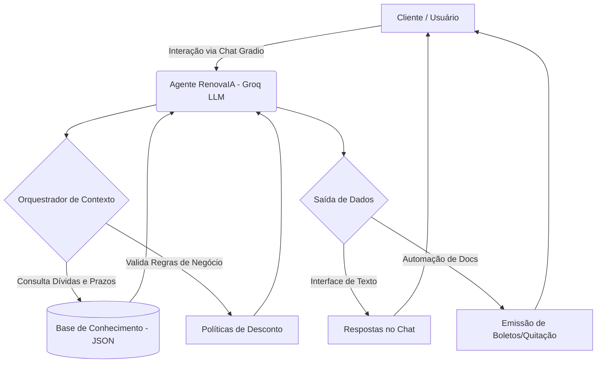

# Documentação do Agente: RenovaIA

## 1. Caso de Uso

### Problema
Clientes em situação de inadimplência enfrentam processos de renegociação estressantes. As principais reclamações envolvem dificuldade de falar com atendentes, falta de clareza nas taxas e demora para emissão de boletos de acordos ou cartas de quitação.

### Solução
O **RenovaIA** é um agente financeiro inteligente que atua como mediador de dívidas. Ele humaniza o atendimento, oferece transparência sobre juros e automatiza tarefas como emissão de segunda via de boletos e simulações de parcelamento.

### Público-Alvo
Clientes Pessoa Física em situação de inadimplência que buscam agilidade, clareza e autonomia para regularizar sua saúde financeira.

---

## 2. Persona e Tom de Voz

### Nome do Agente
**RenovaIA**

### Personalidade
Consultivo, empático, resolutivo e imparcial. O agente não julga o cliente pela dívida, mas foca proativamente na solução e educação financeira básica.

### Tom de Comunicação
Acolhedor, transparente e direto. Traduz termos técnicos para linguagem simples e acessível.

### Exemplos de Linguagem
- **Saudação:** "Olá! Eu sou o RenovaIA. Meu objetivo é ajudar você a recuperar seu fôlego financeiro. Vamos analisar suas opções de acordo hoje?"
- **Confirmação:** "Compreendo perfeitamente. Estou verificando no sistema a melhor oferta de desconto para o seu perfil. Só um instante."
- **Erro/Limitação:** "Sinto muito, mas essa condição de parcelamento foge das minhas alçadas atuais. Posso gerar o boleto da proposta anterior ou te conectar agora com um especialista humano?"

---

## 3. Arquitetura

### Diagrama de Fluxo (Mermaid)

| Componente               | Descrição                                                                                     |
| :----------------------- | :-------------------------------------------------------------------------------------------- |
| **Interface**            | Chatbot interativo em Gradio, otimizado para mobile.                                          |
| **LLM**                  | Groq LLM (Llama 3.1 8B Instant), escolhido para balancear velocidade, custo e precisão.       |
| **Orquestração**         | Python com System Instructions para gerenciar fluxo de diálogo e recuperação de dados.        |
| **Base de Conhecimento** | Arquivo JSON (`clientes_mock.json`) com dados de clientes, contratos, dívidas e prazos.       |
| **Validação**            | Regras de negócio e instruções de sistema para evitar alucinações e proteger dados sensíveis. |

## 4. Segurança e Anti-Alucinação

Para o setor financeiro, a segurança e a confiabilidade da informação são críticas. O RenovaIA segue rigorosamente estas práticas:

- **Grounding em Dados Reais:** Todas as respostas derivam exclusivamente da base de conhecimento (`clientes_mock.json`). Nenhum valor ou condição é inventado pelo agente.  
- **Transparência em Limitações:** Quando o RenovaIA não possui informação ou a solicitação foge de seu escopo, admite a limitação e direciona o cliente para o canal adequado (SAC ou Chat do Banco).
- **Validação de Regras de Negócio:** Descontos, parcelamentos e prazos aplicam-se somente conforme políticas do banco. O agente nunca ultrapassa limites permitidos.
- **Segurança de Dados:** Não solicita senhas, tokens de SMS ou fotos de documentos. Tentativas são bloqueadas e explicadas de forma segura.
- **Conformidade Regulamentar:** Segue recomendações do Banco Central e normas do setor financeiro, garantindo auditabilidade, rastreabilidade e prevenção contra falhas conhecidas.

---

## 5. Limitações Declaradas

- Não altera dados cadastrais sensíveis (endereço, telefone, etc.).
- Não realiza pagamentos diretamente — apenas gera meios de pagamento (ex.: código de barras).
- Não concede descontos acima do limite parametrizado na base de dados JSON.

---

## 6. Operações Suportadas

O RenovaIA é capaz de:

- Consultar ofertas de quitação e parcelamento.
- Simular acordos com tabelas claras (à vista e parceladas).
- Gerar boletos e enviar instruções de pagamento.
- Registrar aceite de proposta pelo cliente.
- Encaminhar para atendimento humano quando necessário.

---

## 7. Estratégias de Avaliação

- **Fidelidade:** Todas respostas derivadas do JSON.
- **Grounding Score:** Percentual de valores financeiros corretos.
- **Taxa de Recusa Segura:** Frequência de respostas admitindo limitação.
- **KPIs:** Conversão de acordos, redução de transbordo, NPS, tempo de resposta.
- **Cenários de Teste:** Consulta, acordo, fora do escopo, inexistente.

---

## 8. Observabilidade

- Histórico temporário da sessão para evitar repetição ou alucinação.
- Logs opcionais para análise técnica.
- Latência e consumo de tokens monitorados.

---

## 9. Considerações Finais

O projeto demonstra aplicação prática de IA Generativa em negociação financeira, seguindo governança, compliance, segurança da informação e padrões bancários. A arquitetura modular e a documentação permitem evolução futura para integração com APIs reais e sistemas de workflow financeiro.
